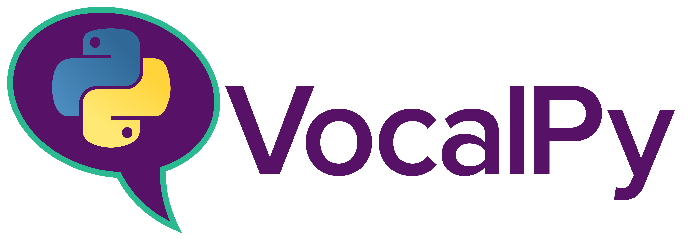

---
jupytext:
  text_representation:
    extension: .md
    format_name: myst
    format_version: 0.13
    jupytext_version: 1.16.4
kernelspec:
  display_name: Python 3 (ipykernel)
  language: python
  name: python3
---

(quickstart)=

# Quickstart: VocalPy 🐍 💬 in 15 minutes ⏲️

+++

This tutorial will introduce you to VocalPy, a core Python package for acoustic communication research.

+++

## Set up

+++

First we import `vocalpy`.

```{code-cell} ipython3
import vocalpy as voc
```

Then we get some example data, from the [Bengalese Finch song repository](https://nickledave.github.io/bfsongrepo/).

```{code-cell} ipython3
:tags: [hide-output]

bfsongrepo = voc.example('bfsongrepo', return_path=True)
```

This gives us back an {py:class}`~vocalpy.examples.example_data.ExampleData` instance with `sound` and `annotation` attributes.

```{code-cell} ipython3
bfsongrepo
```

The {py:class}`~vocalpy.examples.example_data.ExampleData` is just a Python {py:class}`dict` that lets us access the values through dot notation, by saying `bfsongrepo.sound` as well as `bfsongrepo["sound"]`, like the [`Bunch` class](https://scikit-learn.org/1.5/modules/generated/sklearn.utils.Bunch.html) returned by functions in the scikit-learn [`datasets` module](https://scikit-learn.org/1.5/api/sklearn.datasets.html).

Since we set the argument `return_path=True`, these attributes are each a {py:class}`list` of {py:class}`pathlib.Path` instances. The default for `return_path` is `False`, and when it is `False`, we get back the data types built into VocalPy that we will introduce below.

Here we want the paths so we can show how to load data in with VocalPy.

+++

## Data types for acoustic communication

+++

One of the main goals of VocalPy is to make it easier to read and write code for bioacoustics and acoustic communication. One way VocalPy achieves that is by providing data types that map onto concepts from those research domains. The benefit of these data types is that they let as researchers write and read code with the same words we use when we talk to each other. Another benefit of the data types are that they make our code more succinct. 

Before we walk through the data types, we show two snippets of code.

The first is written in standard scientific Python.

```python
import soundfile
from scipy.signal import spectrogram

# we write a helper function to compute a spectrogram
def spect(data, fs, fft=1024, window='Hann'):
    f, t, s = spectrogram(data, fs, fft=fft, window=window)
    return f, t, s

# notice that we need two variables for one sound
data_bird1, fs_bird1 = soundfile.read('./path/to/bird1.wav')
# that turn into three more variables for the spectrogram
f_bird1, t_bird1, s_bird1 = spect(data_bird1, fs_bird1)
# and another two variables for another sound
data_bird2, fs_bird2 = soundfile.read('./path/to/bird2.wav')
# and that again turns into three more variables for the spectrogram
f_bird2, t_bird2, s_bird2 = spect(data_bird2, fs_bird2)
# these variables are cluttering up our code!
# of course, it's common for most audio signals in your data to have the same sampling rate
# but this is definitely not always true!
# and likewise it's common to generate spectrograms all with the same frequency bins
# but still we need to do all this book-keeping with variables

# definitions of functions below are not shown in snippet
ftrs_bird1 = extract_features(s_bird1, t_bird1, f_bird1)
ftrs_bird2 = extract_features(s_bird2, t_bird2, f_bird2)
rejected_h0, pval = stats_helper(ftrs_bird1, ftrs_bird2)
```

The second snippet is written with VocalPy.

```python
import vocalpy as voc
from scipy.signal import spectrogram

# we write a helper function to compute a spectrogram
# but notice we get rid of one of the arguments
# instead of "data" and "sampling rate" we just have a Sound
# we'll see below that the sound "encapsulates" the `data` and `samplerate` attributes
def spect(sound, fft=1024, window='Hann'):
    f, t, s = spectrogram(audio.data, audio.samplerate,
    fft=fft, window=window)
    # instead of returning three variables we just return one Spectrogram instance
    # that again encapsulates the spectrogram matrix, the frequencies, and the times
    return voc.Spectrogram(data=s, frequencies=f, times=t)

# we can also reduce some duplication using a dictionary that maps IDs to variables
ftrs = {}
for bird in ('bird1', 'bird2'):
    # here we load the Sound with the data and samplerate attributes
    # so we only have one variable instead of two
    sound = voc.Sound.read(f'./path/to/{bird}.wav')
    
    spect = spect(audio)
    ftrs[bird] = extract_features(spect)
rejected_h0, pval = stats_helper(ftrs['bird1'], ftrs['bird2'])
```

As the comments indicate, using VocalPy makes the code more succinct, and more readable.  

To learn more about the design and goals of VocalPy, please check out our Forum Acusticum 2023 Proceedings Paper, ["Introducing VocalPy"](https://github.com/vocalpy/vocalpy/blob/main/docs/fa2023/Introducing_VocalPy__a_core_Python_package_for_researchers_studying_animal_acoustic_communication.pdf), this [PyData Global 2023 talk](https://youtu.be/53S5xM6s70g?feature=shared) and this [Python Exchange talk](https://youtu.be/PtTegIM6m1o?feature=shared).

+++

Now let's look at the data types that VocalPy provides for acoustic comunication.

+++

### Data type for sound: {py:class}`vocalpy.Sound`

+++

The first data type we'll learn about is one that represents a sound, not suprisingly named {py:class}`vocalpy.Sound`. 
We start here since all our analyses start with sound.
We can load an audio signal from a file using the {py:meth}`vocalpy.Sound.read` method.

```{code-cell} ipython3
wav_path = bfsongrepo.sound[0]  # we write this out just to make it explicit that we have a pathlib.Path pointing to a wav audio file
a_sound = voc.Sound.read(wav_path)
print(a_sound)
```

A sound has two attributes:

1. `data`, the audio signal itself, with two dimensions: (channels, samples)

```{code-cell} ipython3
print(a_sound.data)
```

2. `samplerate`, the sampling rate for the audio

```{code-cell} ipython3
print(a_sound.samplerate)
```

A `Sound` also has three properties, derived from its data:
1. `channels`, the number of channels
2. `samples`, the number of samples, and
3. `duration`, the number of samples divided by the sampling rate.

```{code-cell} ipython3
print(
    f"This sound comes from an audio file with {a_sound.channels} channel, "
    f"{a_sound.samples} samples, and a duration of {a_sound.duration:.3f} seconds"
)
```

One of the reasons VocalPy provides this data type, and the others we're about to show you here, is that it helps you write more succinct code that's easier to read: for you, when you come back to your code months from now, and for others that want to read the code you share.

+++

When you are working with your own data, instead of example data built into VocalPy, you will do something like:  

1. Get all the paths to the sound files in a directory using a convenience function that VocalPy gives us in its {py:mod}`~vocalpy.paths` module, {py:func}`vocalpy.paths.from_dir`
2. Read all the sound files into memory using the method {py:meth}`vocalpy.Sound.read`:

This is shown in the snippet below

```python
data_dir = ('data/bfsongrepo/gy6or6/032312/')
wav_paths = voc.paths.from_dir(data_dir, 'wav')
sounds = [
    voc.Sound.read(wav_path) for wav_path in wav_paths
]
```

We'll demonstrate this now. 
To demonstrate, we use the `parent` attribute of one of the paths to the wav files in our example `bfsongrepo` data.
In this case, the `parent` is the directory that the wav file is in.

We can be sure that all the wav files are in this directory, because when you call {py:func}`vocalpy.example` with the name of the example dataset, `'bfsongrepo'`, VocalPy uses the library `pooch` (https://www.fatiando.org/pooch/latest/index.html) to "fetch" that dataset off of Zenodo and download it into a local "cache" directory.

```{code-cell} ipython3
data_dir = bfsongrepo.sound[0].parent
print(data_dir)
```

We then use the {py:func}`vocalpy.paths.from_dir` function to get all the wav files from that directory.

```{code-cell} ipython3
wav_paths = voc.paths.from_dir(data_dir, 'wav')
```

Not surprisingly, these are the wav files we already have in our `bfsongrepo` example data.

```{code-cell} ipython3
sorted(wav_paths) == sorted(bfsongrepo.sound)
```

(We're just showing how you would do this with a directory of your data.)  
Finally we can load all these files, as was shown in the last line of the snippet.

```{code-cell} ipython3
sounds = [
    voc.Sound.read(wav_path) for wav_path in wav_paths
]
```

Next we'll show how to work with sound in a pipeline for processing data. 
For more detail on how to use the {py:class}`vocalpy.Sound` class, 
please see the "examples" section of the API documentation 
(that you can go to by clicking on the name of the class 
in this sentence).

## Classes for steps in pipelines for processing data in acoustic communication

+++

In addition to data types for acoustic communication, VocalPy provides you with classes that represent steps in pipelines for processing that data. These classes are also written with readability and reproducibility in mind.

+++

Let's use one of those classes, {py:class}`~vocalpy.SpectrogramMaker`, to make a spectrogram from each one of the wav files that we loaded above.

We'll write a brief snippet to do so, and then we'll explain what we did.

```{code-cell} ipython3
:tags: [hide-output]

params = {'n_fft': 512, 'hop_length': 64}
callback = voc.spectrogram
spect_maker = voc.SpectrogramMaker(callback=callback, params=params)
spects = spect_maker.make(sounds, parallelize=True)
```

Notice a couple of things about this snippet:
- In line 1, you declare the parameters that you use to generate spectrograms explicitly, as a dictionary. This helps with reproducibility by encouraging you to document those parameters
- In line 2, you also decide what function you will use to generate the spectrograms. Here we use the helper function {py:func}`vocalpy.spectrogram`.
- In line 3, you create an instance of the {py:class}`~vocalpy.SpectrogramMaker` class with the function you want to use to generate spectrograms, and the parameters to use with that function. We refer to the function we pass in as a `callback`, because the {py:class}`~vocalpy.SpectrogramMaker` will "call back" to this function when it makes a spectrogram.
- In line 4, you make the spectrograms, with a single call to the method {py:meth}`vocalpy.SpectrogramMaker.make`. You pass in the sounds we loaded earlier, and you tell VocalPy that you want to parallelize the generation of the spectrograms. This is done for you, using the library {py:mod}`dask`.

+++

### Data type: {py:class}`vocalpy.Spectrogram`

+++

As you might have guessed, when we call {py:meth}`vocalpy.SpectrogramMaker.make`, we get back a list of spectrograms.

This is the next data type we'll look at.

+++

We inspect the first spectrogram we loaded.

```{code-cell} ipython3
a_spect = spects[0]
print(a_spect)
```

As before, we'll walk through the attributes of this class.
But since the whole point of a spectrogram is to let us see sound, let's actually look at the spectrogram, instead of staring at arrays of numbers.

We do so by calling {py:func}`vocalpy.plot.spectrogram`.

```{code-cell} ipython3
voc.plot.spectrogram(
    a_spect,
    tlim = [2.6, 4],
    flim=[500,12500],
)
```

We see that we have a spectrogram of Bengalese finch song.

Now that we know what we're working with, let's actually inspect the attributes of the {py:class}`vocalpy.Spectrogram` instance.

+++

There are three attributes we care about here.

1. `data`: this is the spectrogram itself -- as with the other data types,like `vocalpy.Sound`, the attribute name `data` indicates this main data we care about

```{code-cell} ipython3
print(a_spect.data)
```

Let's look at the shape of `data`. It's really just a NumPy array, so we inspect the array's `shape` attribute.

```{code-cell} ipython3
print(a_spect.data.shape)
```

We see that we have an array with dimensions (channels, frequencies, times). The last two dimensions correspond to the next two attributes we will look at.

+++

2. `frequencies`, a vector of the frequency for each row of the spectrogram.

```{code-cell} ipython3
print(a_spect.frequencies[:10])
```

And we can confirm it has a length equal to the number of rows in the spectrogram.

```{code-cell} ipython3
print(a_spect.frequencies.shape)
```

3. `times`, a vector of the time for each column in the spectrogram.

```{code-cell} ipython3
print(a_spect.times[:10])
```

We can likewise see it that the `times` vector has a shape equal to the number of columns in the spectrogram.

```{code-cell} ipython3
print(a_spect.times.shape)
```

Just like with the `Sound` class, VocalPy gives us the ability to conveniently read and write spectrograms from files. This saves us from generating spectrograms over and over. Computing spectrograms can be computionally expensive, if your audio has a high sampling rate or you are using methods like multi-taper spectrograms. Saving spectrograms from files also makes it easier for you to share your data in the exact form you used it, so that it's easier to replicate your analyses.

+++

To see this in action, let's write our spectrograms to files.

```{code-cell} ipython3
import pathlib

DATA_DIR = pathlib.Path('./data')
DATA_DIR.mkdir(exist_ok=True)

for spect, wav_path in zip(spects, wav_paths):
    spect.write(
        DATA_DIR / (wav_path.name + '.spect.npz')
    )
```

Notice that the extension is `'npz'`; this is a file format that NumPy uses to save mulitple arrays in a single file. By convention we include the file extension of the source audio, and another "extension" that incidicates this is a spectrogram, so that the file name ends with `'.wav.spect.npz'`.

+++

We can confirm that reading and writing spectrograms to disk works as we expect using the method {py:meth}`vocalpy.Spectrogram.read`

```{code-cell} ipython3
spect_paths = voc.paths.from_dir(DATA_DIR, '.spect.npz')
```

```{code-cell} ipython3
spects_loaded = [
    voc.Spectrogram.read(spect_path)
    for spect_path in spect_paths
]
```

We compare with the equality operator to confirm we loaded what we saved.

```{code-cell} ipython3
all([
    spect == spect_loaded
    for spect, spect_loaded in zip(spects, spects_loaded)
])  
```

Notice that we can be sure that `spects` and `spects_loaded` are in the same order, because {py:func}`vocalpy.paths.from_dir` calls {py:func}`sorted` on the paths that it finds, and our spectrogram files will be in the same order as the audio files because of the naming convention we used: the name of the audio file, plus the extension "`.spect.npz`". If you used a different naming convention, you'd need to make sure both lists are in the same order a different way (you can tell {py:func}`sorted` how to sort using its `key` argument).

+++

### Data type: `vocalpy.Annotation`

+++

The last data type we'll look at is for annotations. Such annotations are important for analysis of aocustic communication and behavior. Under the hood, VocalPy uses the pyOpenSci package {py:mod}`crowsetta` (<https://github.com/vocalpy/crowsetta>).

```{code-cell} ipython3
import vocalpy as voc
```

```{code-cell} ipython3
annots = [voc.Annotation.read(notmat_path, format='simple-seq') 
          for notmat_path in bfsongrepo.annotation]
```

We inspect one of the annotations. Again as with other data types, we can see there is a `data` attribute. In this case it contains the {py:class}`crowsetta.Annotation`.

```{code-cell} ipython3
print(annots[1])
```

We plot the spectrogram along with the annotations.

```{code-cell} ipython3
voc.plot.annotated_spectrogram(
    spect=spects[1],
    annot=annots[1],
    tlim = [3.2, 3.9],
    flim=[500,12500],
);
```

This crash course in VocalPy has introduced you to the key features and goals of the library.

To learn more and see specific examples of usage, please see the [how-to](#how-tos) section of the [user guide](#user-guide)).
For example, there you can find walkthroughs of [how to use VocalPy to extract acoustic features that you fit a classifier to with scikit-learn](#how-to-sklearn),
and [how to use VocalPy to prepare your data for dimensionality reduction and clustering with UMAP and HDBSCAN](#how-to-umap-hdbscan).

We are actively developing the library to meet your needs and would love to hear your feedback in [our forum](https://forum.vocalpy.org/).
