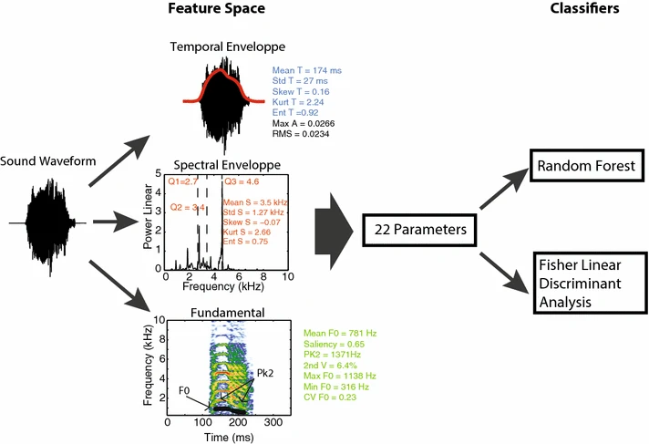

---
jupytext:
  text_representation:
    extension: .md
    format_name: myst
    format_version: 0.13
    jupytext_version: 1.16.4
kernelspec:
  display_name: Python 3 (ipykernel)
  language: python
  name: python3
---

(how-to-sklearn)=
# How to use VocalPy with scikit-learn to fit supervised learning models to acoustic features

Many analyses in bioacoustics and communication rely on machine learning models. For example, it is common to use supervised machine learning models to support the idea that vocalizations contain information about individual identity or emotional valence. 
This is done by showing that a classifier can successfully predict the identity or valence of vocalizations when fit to acoustic features extracted from the sounds. See for example [1] or [2].

scikit-learn is one of the most widely used library in the Python programming language for fitting supervised machine learning models. Here we will show you how to extract acoustics features from sounds using VocalPy, and then fit a model to those features with scikit-learn. The example we will walk through is of classifying individual zebra finches using acoustic parameters extracted from their calls. The material here is adapted in part from the BioSound tutorial from the Theunissen lab (https://github.com/theunissenlab/BioSoundTutorial) that demonstrates how to use their library soundsig (https://github.com/theunissenlab/soundsig).

```{code-cell} ipython3
import numpy as np
import pandas as pd
import sklearn
import vocalpy as voc
```

For this how-to, we use a subset of data from [this dataset](https://figshare.com/articles/dataset/Vocal_repertoires_from_adult_and_chick_male_and_female_zebra_finches_Taeniopygia_guttata_/11905533) shared by Elie and Theunissen, as used in their [2016 paper](https://link.springer.com/article/10.1007/s10071-015-0933-6) and their [2018 paper](https://www.nature.com/articles/s41467-018-06394-9). To get the subset of data we will use, we can call the {py:func}`vocalpy.example` function (that, under the hood, "fetches" the data using the excellent library [`pooch`](https://www.fatiando.org/pooch/latest/index.html)).

```{code-cell} ipython3
zblib = voc.example("zblib", return_path=True)
```

Since this example data is more than one file, when we call {py:func}`vocalpy.example` we will get back an instance of the {py:class}`~vocalpy.examples.ExampleData` class. This class is like a {py:class}`dict` where you can get the values by using dot notation instead of keys, e.g. by writing `zblib.sound` instead of `zblib["sound"]`.

```{code-cell} ipython3
print(zblib)
```

By default, the {py:func}`vocalpy.example` function gives us back an {} that contains VocalPy data types like {py:class}`vocalpy.Sound`, but in this case we want the paths to the files. We want the paths to the files because the filenames contain the ID of the zebra finch that made the sound, and below we will need to extract those IDs from the filenames so we can train a model to classify IDs.  To get back a {py:class}`list` of {py:class}`pathlib.Path` instances, instead of {py:class}`vocalpy.Sound` instances, we set the argument `return_path` to `True`. We confirm that we got back paths by printing the first element of the list.

```{code-cell} ipython3
print(zblib.sound[0])
```

We make a helper function to get the bird IDs from the filenames.  

We will use this below when we want to predict the bird ID from the extracted features.

```{code-cell} ipython3
def bird_id_from_path(wav_path):
    """Helper function that gets a bird ID from a path"""
    return wav_path.name.split('_')[0]
```

We run a quick test to confirm this works as we expect.

```{code-cell} ipython3
bird_id_from_path(zblib.sound[0])
```

Then we use a list comprehension to get the ID from all 91 files.

```{code-cell} ipython3
bird_ids = [
    bird_id_from_path(wav_path)
    for wav_path in zblib.sound
]
```

## Feature extraction

Now we extract the acoustic features we will use to classify.  
To extract the acoustic features, we will use the function {py:func}`vocalpy.feature.biosound`.

We will extract a subset of the features used by Elie and Theunissen in the articles linked above (and related work), that are depicted schematically below ([figure 1](https://link.springer.com/article/10.1007/s10071-015-0933-6/figures/1) from their 2016 paper):  



For this example we use only the features extracted from the temporal and spectral envelope, since those are relatively quick to extract. For an example that uses fundamental frequency estimation, see the notebook that this is adapted from: https://github.com/theunissenlab/BioSoundTutorial/blob/master/BioSound4.ipynb

Here we are going to use the {py:class}`~vocalpy.FeatureExtractor` class. This works like other pipeline classes in VocalPy, where we tell the {py:class}`~vocalpy.FeatureExtractor` what `callback` we want to use, and we explicitly declare a set of parameters `params` to use with the callback function. This design is meant to help us document the methods we use more clearly and concisely.

```{code-cell} ipython3
callback = voc.feature.biosound
params = dict(ftr_groups=("temporal", "spectral"))
extractor = voc.FeatureExtractor(callback, params)
```

We are going to only use channel of the audio to extract features. The function we will use to extract features, {py:func}`vocalpy.feature.biosound`, will work on audio with multiple channels, but for demonstration purposes we just need one. To just get the first channel from each sound, we can use indexing (for more detail and examples of how this works, see the API documentation for this class: {py:class}`vocalpy.Sound`).

```{code-cell} ipython3
sounds = []
for wav_path in zblib.sound:
    sounds.append(
        voc.Sound.read(wav_path)[0]  # indexing with `[0]` gives us the first channel
    )
```

Now finally we can pass this list of (single-channel) sounds into the {py:meth}`~vocalpy.FeatureExtractor.extract` method, and get back a list of {py:class}`~vocalpy.Features`, one for every sound.

```{code-cell} ipython3
:tags: [hide-output]
features_list = extractor.extract(sounds, parallelize=True)
```

## Data preparation

Now what we want to get from our extracted features is two NumPy arrays, `X` and `y`.  

These represent the samples $X_i$ in our dataset with their features $x$, and the labels for those samples $y_i$. In this case we have a total of $m=$91 samples (where $i \in 1, 2, ... m$).

We get these arrays as follows (noting there are always multiple ways to do things when you're programming):
- Take the `data` attribute of the {py:class}`~vocalpy.Features` we got back from the {py:class}`~vocalpy.FeatureExtractor` and convert it to a {py:class}`pandas.DataFrame` with one row: the scalar set of features for exactly one sound
- Use {py:mod}`pandas` to concatenate all those {py:class}`~pandas.DataFrame`s, so we end up with 91 rows
- Add a column to this `DataFrame` with the IDs of the birds -- we then have $X$ and $y$ in a single table we could save to a csv file, to do further analysis on later
- We get $X$ by using the `values` attribute of the `DataFrame`, which is a numpy array
- We get $y$ using {py:func}`pandas.factorize`, that converts the unique set of strings in the `"id"` column into integer class labels: i.e., since there are 4 birds, for every row we get a value from $\{0, 1, 2, 3\}$

```{code-cell} ipython3
df = pd.concat(
    [features.data.to_pandas()
    for features in features_list]
)
```

```{code-cell} ipython3
df.head()
```

```{code-cell} ipython3
df["id"] = pd.array(bird_ids, dtype="str")
y, _ = df["id"].factorize()
X = df.values[:, :-1]  # -1 because we don't want 'id' column
```

## Fitting a Random Forest classifier

Finally we will train a classifer from `scikit-learn` to classify these individuals. The original paper uses Linear Discriminant Analysis, but here we fit a random forest classifier, again simply because the random forest models are fast to fit.

```{code-cell} ipython3
import sklearn.model_selection
```

First we split the data into training and test splits using {py:func}`sklearn.model_selection.train_test_split`.

```{code-cell} ipython3
X_train, X_val, y_train, y_val = sklearn.model_selection.train_test_split(
    X, y, stratify=y, train_size=0.8
)
```

```{code-cell} ipython3
from sklearn.ensemble import RandomForestClassifier
```

Finally we can instantiate our model and fit it.

```{code-cell} ipython3
clf = RandomForestClassifier(max_depth=2, random_state=0)
clf.fit(X_train, y_train)
```

And we can evaluate the model's performance on a test set.

```{code-cell} ipython3
print(
    f"Accuracy: {clf.score(X_val, y_val) * 100:0.2f}%"
)
```

Looks pretty good!

Now you have seen a simple example of how to extract acoustic features from your data with VocalPy, and fit a model to them with scikit-learn.
